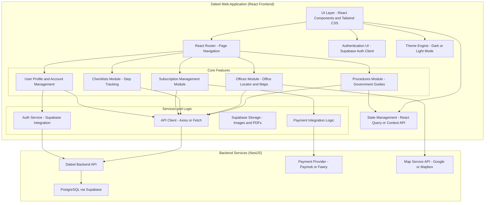
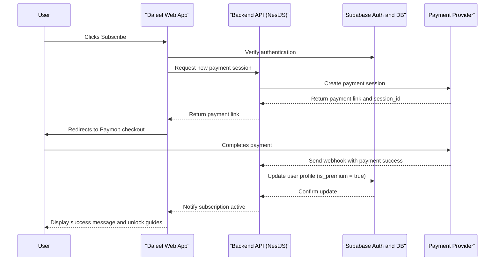
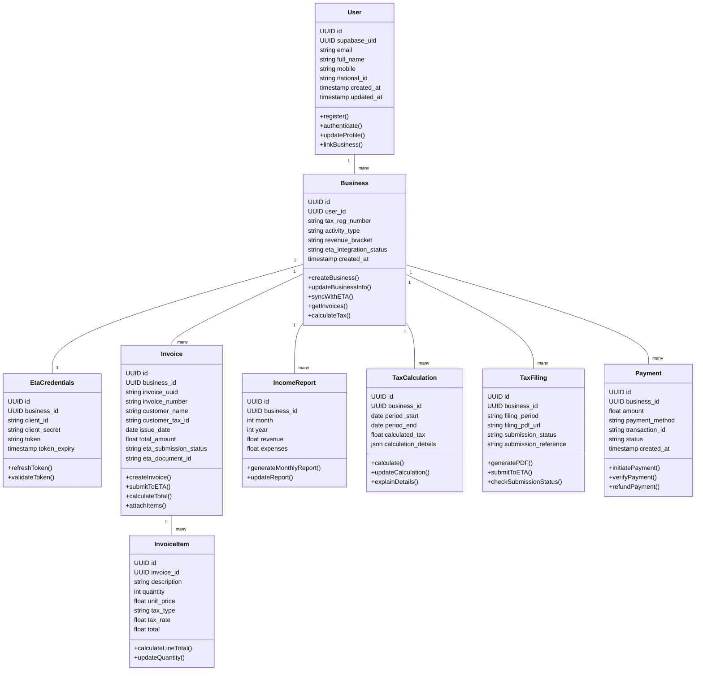
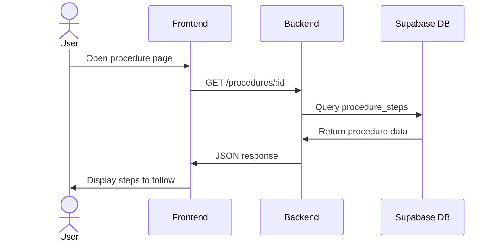

# Daleel Application Documentation

- [Daleel Application Documentation](#daleel-application-documentation)
  - [Project Overview](#project-overview)
  - [1. UML Diagrams](#1-uml-diagrams)
    - [1.1. Component Diagram](#11-component-diagram)
    - [1.2. Sequence Diagram: Subscription Flow](#12-sequence-diagram-subscription-flow)
    - [1.3. Class / Entity Diagram: Data Model](#13-class--entity-diagram-data-model)
    - [1.4. Sequence Diagram: Viewing a Government Procedure](#14-sequence-diagram-viewing-a-government-procedure)
    - [1.5. Use Case Diagram](#15-use-case-diagram)
  - [2. Application Manual](#2-application-manual)
    - [2.1. Feature Guides](#21-feature-guides)
      - [2.1.1. Government Documentation Search & Access](#211-government-documentation-search--access)
      - [2.1.2. Office Locator](#212-office-locator)
      - [2.1.3. Step-by-Step Checklist](#213-step-by-step-checklist)
      - [2.1.4. Subscription & Account Management](#214-subscription--account-management)
    - [2.2. Settings Configuration](#22-settings-configuration)
  - [3. Business Case](#3-business-case)
    - [3.1. Market Analysis](#31-market-analysis)
    - [3.2. Revenue Models](#32-revenue-models)
    - [3.3. User Acquisition Strategy](#33-user-acquisition-strategy)
    - [3.4. Cost Structure](#34-cost-structure)
    - [3.5. Break-Even Analysis and Projected ROI](#35-break-even-analysis-and-projected-roi)
    - [3.6. Potential Expansion Opportunities](#36-potential-expansion-opportunities)
  - [4. SWOT Analysis](#4-swot-analysis)
    - [Strengths](#strengths)
    - [Weaknesses](#weaknesses)
    - [Opportunities](#opportunities)
    - [Threats](#threats)
  - [Addressing Key Problem Statements](#addressing-key-problem-statements)

## Project Overview
This project is a modern web platform that provides complete guidance on how and where to obtain government documentation in Egypt, such as ID cards, passports, birth certificates, licenses, and more.
The website offers detailed, verified, and continuously updated instructions on each process — including required documents, steps, fees, and official locations.

Users must create an account and subscribe to gain access to the platform.
Only paid subscribers can view the documentation, guides, and step-by-step procedures.
The platform’s goal is to make dealing with government paperwork simpler, faster, and more reliable, eliminating confusion and wasted time.

**Core Problems Addressed:**
1. Scattered and outdated information about government procedures.
2. Difficulty identifying correct steps, fees, and required forms.
3. Frequent wasted visits due to missing or incorrect documents.
4. No centralized, verified source for all documentation needs.
5. Lack of transparency and clarity in official processes.

**Technical Stack:**
- **Frontend:** React.js  
- **Backend:** NestJS  
- **Database & Auth:** Supabase (PostgreSQL + Auth + Storage)  
- **Language:** TypeScript  
- **State Management:** React Query or Context API  
- **Security:** JWT authentication and subscription-based access control

## 1. UML Diagrams

### 1.1. Component Diagram

This diagram illustrates the high-level architecture and dependencies between major components of the **Daleel** platform.

---

### 1.2. Sequence Diagram: Subscription Flow

This diagram shows the sequence of interactions when a user subscribes to access Daleel’s content.

---

### 1.3. Class / Entity Diagram: Data Model

This represents the main database entities and their relationships.

---

### 1.4. Sequence Diagram: Viewing a Government Procedure

---

### 1.5. Use Case Diagram

---

> This diagram shows the main actors and their interactions with the system.  
> The *User* interacts with the Daleel platform to create an account, subscribe, search, and view procedures, while the *Admin* manages content and pricing.  
> The *Payment Provider* handles external payment transactions.

## 2. Application Manual

### 2.1. Feature Guides

#### 2.1.1. Government Documentation Search & Access

- **Overview:**  
  Access the **“Services”** section from the main navigation bar.  
  The main page provides a categorized list of all available government documentation guides (e.g., National ID, Passport Renewal, Birth Certificate, Driver’s License, etc.).

  - Browse or search for any government service using keywords (e.g., “passport”, “tax card”).  
  - Each service entry displays a short summary, estimated time, and associated fees.  
  - Click on a service to open its detailed guide.

- **Viewing a Documentation Guide:**  
  - After selecting a service, you will be redirected to a step-by-step guide.  
  - Each step includes:
    - Description of the process (e.g., “Submit the completed application form at your local civil office”).  
    - Required documents.  
    - Associated fees and payment methods.  
    - Estimated processing time.  
  - You can mark steps as completed as you progress.

- **Subscription Access:**  
  - All users must **create an account** and **subscribe** to access any documentation guide.  
  - After logging in, navigate to **“Subscribe”** to activate your premium plan.  
  - Once subscribed, full access to all documentation guides, office locators, and downloadable checklists becomes available.

- **Search Filters:**  
  - Filter by category (e.g., “Civil Status”, “Traffic & Licenses”, “Taxes & Business”).  
  - Filter by city or region to view offices closest to you.  
  - Sort results by most viewed or most recent updates.

---

#### 2.1.2. Office Locator

- **Overview:**  
  Access the **“Offices”** section to find nearby government service branches.  
  The map view displays each office location and its available services.

  - Each office card shows:
    - Office name and category (e.g., “Nasr City Civil Registry”).  
    - Address, working hours, and contact details.  
    - Supported services (e.g., National ID Renewal, Birth Certificate).  

- **Using the Map View:**  
  - You can zoom in/out to explore different areas.  
  - Click a location marker to view office details and navigate using Google Maps or Mapbox integration.  
  - The system automatically detects your city to prioritize nearby offices.

---

#### 2.1.3. Step-by-Step Checklist

- **Overview:**  
  Each documentation guide includes a dynamic checklist generated from the service steps.  
  The checklist allows users to track their progress.

- **Usage:**
  - Open a service guide (e.g., “Renew National ID”).  
  - Tap **“Generate Checklist”** to create a personalized list.  
  - Check items off as you complete them.  
  - Download or print the checklist for offline use (PDF format).

---

#### 2.1.4. Subscription & Account Management

- **Overview:**  
  Access the **“Profile”** tab in the navigation menu to manage account details and subscription.

- **Account Information:**  
  - View and edit your name and email.  
  - Manage your subscription plan (monthly or annual).  
  - View payment history and renewal date.

- **Subscription Settings:**  
  - Upgrade or cancel your subscription anytime.  
  - Automatic renewal is enabled unless disabled manually.  
  - Access to all guides is revoked if the subscription expires.

- **Security Settings:**  
  - Change password and manage login credentials.  
  - Two-factor authentication (2FA) available for added security.  
  - Session logout available for all connected devices.

- **Theme Preferences:**  
  - Toggle between **Light Mode** and **Dark Mode** from the profile settings.

---

### 2.2. Settings Configuration

- **Theme:**  
  Profile > Preferences > Theme > Select “Light” or “Dark”.

- **Language:**  
  Profile > Preferences > Language > Choose Arabic or English (default).

- **Notifications:**  
  Profile > Preferences > Notifications > Enable or disable email alerts for service updates.

- **Checklist Management:**  
  Services > Select a Procedure > Generate Checklist > Download or Print.

- **Subscription Renewal:**  
  Profile > Subscription > Manage Plan > Renew or Cancel Subscription.

- **Security Settings:**  
  Profile > Security > Enable 2FA or Change Password.

---

## 3. Business Case

### 3.1. Market Analysis

- **Target Market:**  
  Egyptian citizens and residents who need to obtain or renew official documents such as national IDs, passports, birth certificates, driver’s licenses, or tax files.  
  The target audience includes **students, professionals, expats, and families**—people who regularly interact with government entities and need **clear, reliable guidance**.

- **Problem Validation:**  
  Government processes in Egypt are often **confusing, fragmented, and time-consuming**.  
  Many citizens face difficulties due to **outdated information**, **unclear requirements**, and **long queues caused by incomplete paperwork**.  
  There is currently **no centralized, user-friendly platform** that explains each process step-by-step or provides verified, updated details.

- **Market Size:**  
  Egypt has a population exceeding **110 million**, with millions of document transactions conducted annually.  
  As digital transformation accelerates across government services, the demand for **online guidance platforms** is expected to grow rapidly.  
  The market opportunity lies in serving both individuals and organizations that require frequent document processing.

- **Competition:**  
  There are **no comprehensive competitors** currently offering a paid, centralized, and verified guide for government documentation in Egypt.  
  Existing information sources (Facebook groups, forums, individual blogs) are unreliable and unstructured.

---

### 3.2. Revenue Models

1. **Subscription Model:**
   - **Paid Access Only:** All users must subscribe to access the website’s guides and documentation.
   - **Subscription Tiers:**  
     - **Monthly Plan:** Short-term access for users handling one or two documents.  
     - **Annual Plan:** Discounted rate for frequent users and businesses.
   - **Included Features:**
     - Full access to all government documentation guides.  
     - Office locator with interactive map.  
     - Step-by-step downloadable checklists.  
     - Updates and notifications for changing requirements and fees.  
     - Multi-language access (Arabic/English).

2. **Partnership Opportunities:**
   - Collaborate with **legal offices, translation agencies, or notary services** to promote premium plans.  
   - Establish affiliate programs with courier/document delivery services.  
   - Offer partnerships to **universities or HR departments** to provide access for employees and students.  

---

### 3.3. User Acquisition Strategy

- **Digital Marketing:**  
  Run targeted campaigns on Facebook, Instagram, TikTok, and Google Search, focusing on keywords like “renew passport Egypt” or “get ID quickly”.

- **Search Engine Optimization (SEO):**  
  Optimize service pages to appear in search results for documentation-related queries in both Arabic and English.

- **Content Marketing:**  
  Create informative posts and blogs explaining simplified versions of document processes, linking to the full premium guide.

- **Institutional Collaborations:**  
  Partner with organizations and universities to offer group subscription plans for their staff and students.

- **Email Marketing:**  
  Send periodic newsletters about newly added documentation guides or updated government procedures.

---

### 3.4. Cost Structure

- **Development Costs:**  
  Frontend development (React), backend (NestJS), and Supabase integration for database and authentication.

- **Maintenance Costs:**  
  Hosting on Vercel (frontend) and Render/Railway (backend), database management, and API maintenance for maps and location services.

- **Marketing & Operations:**  
  Paid advertising, SEO optimization, content creation, and customer support.

- **Operational Costs:**  
  Team salaries (developers, designers, content managers, marketing), payment gateway fees, and legal setup.

---

### 3.5. Break-Even Analysis and Projected ROI

- **Assumptions:**  
  Based on estimated user acquisition cost (CAC), monthly subscriptions, and annual retention rate.  
  Revenue will scale with the number of active subscribers.

- **Break-Even Point:**  
  Expected within **2–3 years** of launch, assuming steady user growth through digital marketing and institutional partnerships.

- **Projected ROI:**  
  With moderate adoption, the project can achieve ROI > 1 within **4–5 years**.  
  Growth depends on expanding content coverage and increasing institutional subscribers.

---

### 3.6. Potential Expansion Opportunities

- **Feature Expansion:**  
  Add online appointment scheduling for government services, document tracking, and notifications for renewal deadlines.

- **Integration Expansion:**  
  Integrate with government APIs (where available) to verify office hours or required documents in real-time.

- **Platform Expansion:**  
  Launch a **mobile app** version for easier access and offline document viewing.

- **B2B Offerings:**  
  Offer tailored enterprise dashboards for HR departments or agencies managing employee documentation.

- **Delivery Partnership Expansion:**  
  If an official agreement is established with government entities, the platform could offer a **“Document Delivery Service”**, allowing users to:
  - Request government documents (e.g., ID renewal, birth certificate, etc.) directly through the platform.
  - Pay securely online for processing and delivery fees.
  - Receive the completed document at their doorstep via verified couriers.
  This feature would transform the platform from an informational service into a **fully operational e-government assistant**.

---

## 4. SWOT Analysis

### Strengths:
- **Centralized Platform:** Brings together all government documentation processes in one accessible, verified, and easy-to-use website.  
- **Reliable Information:** Provides officially verified, step-by-step guides with updated fees, locations, and requirements.  
- **User Subscription Model:** Ensures a steady revenue stream while maintaining exclusive, high-quality content.  
- **Modern Tech Stack:** Built with **React**, **NestJS**, and **Supabase**, enabling fast performance, scalability, and secure authentication.  
- **Multilingual Support:** Offers both **Arabic and English**, making it accessible to a wider range of users, including expats.  
- **Future Integration Ready:** Designed to integrate with government APIs or delivery services for document handling and tracking.  

---

### Weaknesses:
- **Data Maintenance:** Requires continuous verification and updating of information to maintain accuracy and trust.  
- **Dependence on Government Cooperation:** Full functionality (e.g., delivery service or real-time updates) depends on official collaboration and API access.  
- **Initial Awareness:** As a new platform, building credibility and user trust in the early stages will be a challenge.  
- **Limited Automation:** Until government integrations are approved, all updates must be managed manually by the platform team.  
- **Subscription-Only Access:** The lack of a free tier might limit early adoption or discourage casual users from subscribing.  

---

### Opportunities:
- **Digital Transformation in Egypt:** The ongoing modernization of government services provides an ideal environment for such a platform.  
- **Government Partnerships:** Potential for official collaboration to offer document **delivery services** or online application submission directly through the platform.  
- **Expansion Potential:** Ability to extend coverage to other governorates.  
- **B2B Services:** Partner with organizations and HR departments to manage employees’ official documentation through bulk access.  
- **Mobile App Launch:** A future **mobile version** could increase accessibility and convenience for users.  
- **Brand Authority:** Opportunity to become the **trusted national hub** for accurate and up-to-date government process information.  

---

### Threats:
- **Regulatory Constraints:** Legal restrictions may limit certain features, such as online document processing or direct government integrations.  
- **Data Accuracy Risks:** Incorrect or outdated information could harm credibility and lead to user dissatisfaction.  
- **Competition from Government Portals:** Future government digital platforms could offer similar services directly.  
- **Cybersecurity Risks:** Data breaches or account compromises could significantly damage user trust, requiring strong encryption and authentication measures.  
- **Economic Instability:** Fluctuating user spending and lower willingness to pay for subscriptions during economic downturns.  

---

## Addressing Key Problem Statements

The Government Documentation Platform directly addresses the identified problems:

1. **Scattered and inconsistent government information:**  
   The platform provides a **centralized and verified database** for all government documentation procedures in Egypt. It consolidates steps, requirements, fees, and office locations into a single, easy-to-navigate interface, removing the confusion caused by unreliable online sources and outdated instructions.

2. **Unclear procedures and missing document requirements:**  
   Each service page includes **step-by-step guides** with clearly listed documents, fees, and expected processing times. Users can follow every stage of the process with confidence, ensuring they are fully prepared before visiting any government office.

3. **Wasted time and repeated visits due to missing papers:**  
   The system generates **automated checklists** for each procedure. Users can mark tasks as completed, verify their readiness, and avoid unnecessary trips caused by forgotten forms or missing photocopies.

4. **Difficulty locating the correct office or branch:**  
   Through the integrated **Office Locator**, users can search by service type or city to find the nearest government office. The feature provides maps, operating hours, and available services, ensuring users go to the correct branch the first time.

5. **Outdated and unreliable data:**  
   The platform is maintained with **regular data updates** and internal verification. In the future, integration with official **government APIs** will allow for real-time updates on fees, document requirements, and office information.

6. **Limited accessibility and convenience:**  
   A future expansion of the platform will include a **Document Delivery Service** (subject to government agreements). This service would allow users to **submit requests digitally** and have their completed documents **delivered securely to their homes**, offering a new level of convenience for citizens and residents.

By solving these core issues, the Government Documentation Platform transforms how users interact with bureaucratic processes — making government services **clearer, faster, and more accessible** for everyone.
