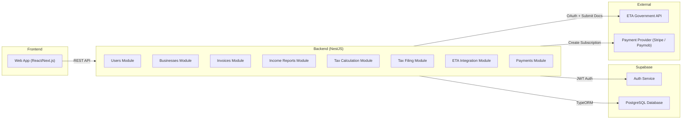
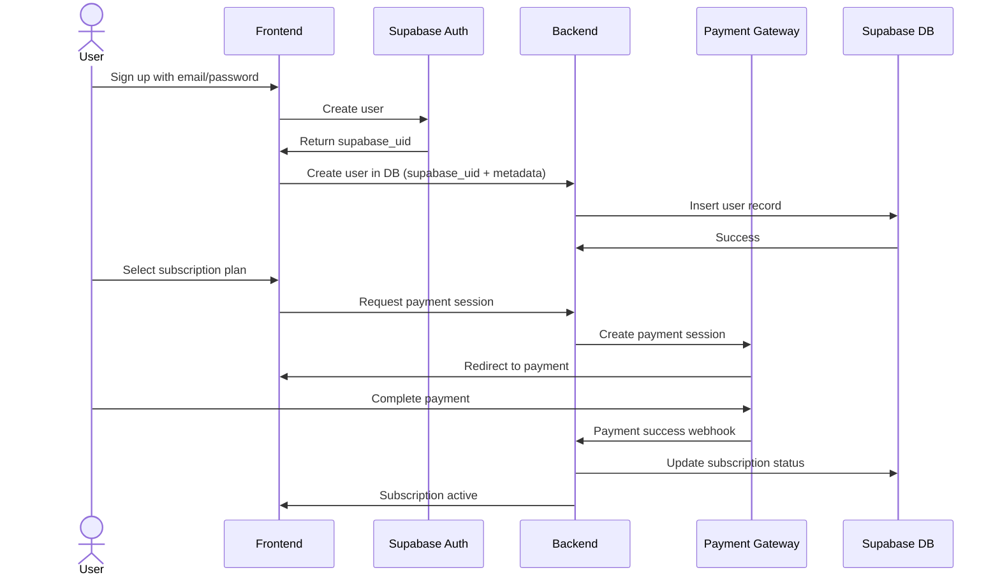
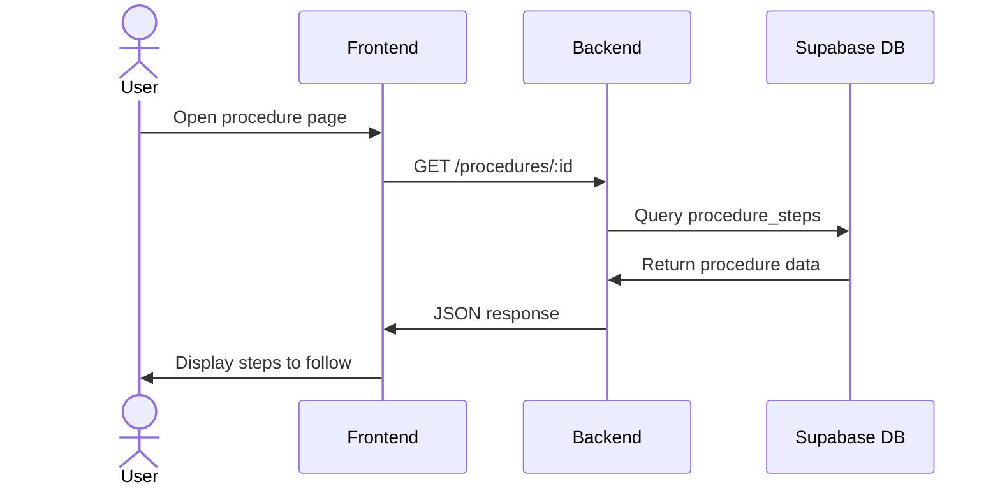
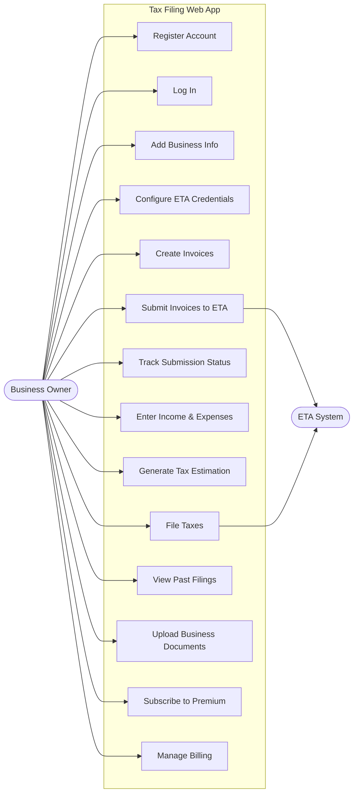

# Daleel Application Documentation

# 🗺️ Table of Contents

- [Daleel Application Documentation](#daleel-application-documentation)
  - [Project Overview](#project-overview)
  - [1. UML Diagrams](#1-uml-diagrams)
    - [1.1. Component Diagram](#11-component-diagram)
    - [1.2. Sequence Diagram: Subscription Flow](#12-sequence-diagram-subscription-flow)
    - [1.3. Class / Entity Diagram: Data Model](#13-class--entity-diagram-data-model)
    - [1.4. Sequence Diagram: Viewing a Government Procedure](#14-sequence-diagram-viewing-a-government-procedure)
    - [1.5. Use Case Diagram](#15-use-case-diagram)
  - [2. Application Manual](#2-application-manual)
    - [2.1. Feature Guides](#21-feature-guides)
      - [2.1.1. Government Documentation Search & Access](#211-government-documentation-search--access)
      - [2.1.2. Office Locator](#212-office-locator)
      - [2.1.3. Step-by-Step Checklist](#213-step-by-step-checklist)
      - [2.1.4. Subscription & Account Management](#214-subscription--account-management)
    - [2.2. Settings Configuration](#22-settings-configuration)
  - [3. Business Case](#3-business-case)
    - [3.1. Market Analysis](#31-market-analysis)
    - [3.2. Revenue Models](#32-revenue-models)
    - [3.3. User Acquisition Strategy](#33-user-acquisition-strategy)
    - [3.4. Cost Structure](#34-cost-structure)
    - [3.5. Break-Even Analysis and Projected ROI](#35-break-even-analysis-and-projected-roi)
    - [3.6. Potential Expansion Opportunities](#36-potential-expansion-opportunities)
  - [4. SWOT Analysis](#4-swot-analysis)
    - [Strengths](#strengths)
    - [Weaknesses](#weaknesses)
    - [Opportunities](#opportunities)
    - [Threats](#threats)
  - [Addressing Key Problem Statements](#addressing-key-problem-statements)

---

## Project Overview
The Tax Application is a SaaS platform that helps businesses in Egypt calculate taxes, manage invoices, integrate with the Egyptian Tax Authority (ETA), and automate tax filing.

**The System Allows Users To:**

1.  **Register and Authenticate** securely via **Supabase Auth** (email).
2.  **Create and Manage** business profiles and settings.
3.  **Submit Invoices** directly to the **ETA eInvoicing** system.
4.  **Track Submission Status** for all submitted invoices.
5.  **Calculate Taxes** automatically for accurate reporting.
6.  **View Financial Reports** (monthly/annual income summaries).
7.  **Manage Subscriptions** for continuous system access.

---

## Technical Stack & Architecture

This application is built using a modern, scalable architecture.

| Component | Technology / Service | Notes |
| :--- | :--- | :--- |
| **Frontend** | React / Next.js | Modern, server-rendered UI framework. |
| **Backend** | NestJS | Clean Architecture pattern for scalable, maintainable APIs. |
| **Database** | Supabase Postgres | Robust and reliable relational database. |
| **Authentication** | Supabase Auth (Email) | Integrated user authentication service. |
| **Integration** | ETA eInvoicing APIs | Direct connection for regulatory compliance. |

## 1. UML Diagrams

### 1.1. Component Diagram

This diagram illustrates the high-level architecture and dependencies between major components of the **Daleel** platform.

---

### 1.2. Sequence Diagram: Subscription Flow

This diagram shows the sequence of interactions when a user subscribes to access Daleel’s content.

---

### 1.3. Class / Entity Diagram: Data Model

This represents the main database entities and their relationships.

---

### 1.4. Sequence Diagram: Viewing a Government Procedure

---

### 1.5. Use Case Diagram

---

## 2. 📘 Application Manual

This section serves as a comprehensive user guide, explaining how to use all the platform's features, from searching documentation to managing subscriptions and configuring settings.

---

### 2.1. Feature Guides

#### 2.1.1. Government Documentation Search & Access

This feature provides a centralized, up-to-date repository of all relevant **government tax documentation** and regulations (e.g., ETA circulars, filing deadlines, legal amendments). Users can use **keywords** to search, filter by **topic** or **date**, and access **PDF or text summaries** directly within the application, ensuring they always have the correct and current information.

#### 2.1.2. Office Locator

The Office Locator helps users quickly find the **nearest official government tax offices or service centers**. The feature uses **geo-location** (if permission is granted) or manually entered addresses/cities. It displays the office's **address**, **contact information**, **operating hours**, and provides **turn-by-turn navigation** via an integrated map.

#### 2.1.3. Step-by-Step Checklist

This tool breaks down complex compliance processes (e.g., **Business Registration**, **Quarterly VAT Filing**, **ETA E-Invoicing Setup**) into **simple, sequential, and actionable steps**. Each step includes a brief explanation, required documents, and a **completion checkbox**. The checklist helps users track their progress and ensures no critical requirement is missed. 

#### 2.1.4. Subscription & Account Management

Users can view and update their personal and business profiles, including contact details and tax registration numbers. This section also handles **Subscription Management**, allowing users to **view current plans**, **upgrade or downgrade tiers** (e.g., Monthly vs. Annual), and access **billing history**. All payments are securely processed via integrated third-party providers like Stripe/Paymob.

---

### 2.2. Settings Configuration

This section allows users to customize their platform experience and manage integration credentials.

* **Notification Settings:** Configure preferences for deadlines, status changes (e.g., invoice rejection), and documentation updates (Email, SMS, or In-App).
* **Business Defaults:** Set default tax rates, currency, and primary business address for automatic application to new invoices.
* **Integration Management:** Configure and manage credentials for **ETA e-Invoicing** (Client ID, Secret) and other potential third-party accounting software APIs.

---

## 3. 💼 Business Case

This section outlines the financial and strategic foundations of the platform, detailing how it will generate revenue, acquire users, and achieve profitability.

---

### 3.1. Market Analysis

The platform targets **Small and Medium Egyptian Businesses (SMEs)**, **Freelancers**, and **Commercial Stores**—a market of **3.8 million active entities** mandated to adopt digital tax compliance, especially the **ETA e-Invoicing system**. The primary pain points addressed are complexity, high costs of traditional compliance, and the risk of fines due to manual errors. Market growth is driven by the government's **Digital Tax Transformation by 2026**.

### 3.2. Revenue Models

| Model | Description | Pricing Structure |
| :--- | :--- | :--- |
| **Subscription Model** (Primary) | Tiered access to all core features (Invoicing, Calculation, Filing, Documentation). | Monthly/Annual plans (Annual offers 20% discount). |
| **API Access** (Secondary) | Charging external developers/ERP systems for direct integration access. | Per-request charge or high-volume usage license fee. |
| **Partner Programs** | Revenue sharing with affiliated accounting firms and tax consultants. | Referral fees and co-branded service packages. |

### 3.3. User Acquisition Strategy

* **Digital Marketing:** Target ads on business-centric platforms (LinkedIn, Facebook Business) focused on compliance and simplicity keywords.
* **Content Marketing:** Publish articles and guides on **Egyptian tax compliance** (SEO-driven).
* **Partnerships:** Form agreements with major **accounting firms** and **industry associations** for client referral.
* **Freemium Model:** Offer a basic tier (e.g., documentation search, simple office locator) to drive sign-ups and demonstrate value.

### 3.4. Cost Structure

* **Fixed Costs:** Salaries (Developers, Support, Admin), Office/Infrastructure leasing (minimal due to cloud-native nature).
* **Variable Costs:** **Cloud Hosting Fees** (AWS/Azure/GCP), **ETA API Fees** (if applicable), **Payment Gateway Fees** (Stripe/Paymob commissions), and **Digital Marketing Spend**.
* **High Upfront Costs:** Initial development, legal fees for compliance verification.

### 3.5. Break-Even Analysis and Projected ROI

* **Break-Even Point (B.E.P.):** Calculated by dividing Total Fixed Costs by (Average Subscription Revenue per User minus Variable Cost per User).
* **Projection:** A realistic target of **X,000 paid subscribers** is needed to cover fixed and variable costs.
* **ROI:** Projected ROI aims for 3x return within three years, achieved by aggressive user acquisition and high retention driven by compliance necessity. 

[Image of a break-even chart showing total revenue and total cost lines]

### 3.6. Potential Expansion Opportunities

* **Geographic Expansion:** Extending services to other **Gulf Cooperation Council (GCC) countries** experiencing digital tax transformation (e.g., KSA, UAE VAT).
* **Product Expansion:** Integrating with additional government services (e.g., Social Insurance Authority) or offering payroll services.
* **Official Partnership:** Seeking an **official partnership or certification** from the ETA to enhance credibility and marketing efforts.

---

## 4. 📊 SWOT Analysis

### Strengths (S)
* **Automated Tax Tools:** Reduces manual effort and minimizes human error.
* **ETA-Compliant:** Directly addresses the mandatory e-Invoicing requirement.
* **Modern Tech Stack:** Ensures scalability, security, and fast performance (React/NestJS/Supabase).
* **Real-time Status:** Provides immediate feedback on invoice submission and tax filing status.

### Weaknesses (W)
* **Reliance on ETA:** Frequent updates from the Egyptian Tax Authority require continuous, mandatory maintenance.
* **High Barrier to Entry:** Requires significant upfront capital for development and compliance legal work.
* **Security Risk:** Handling sensitive financial and tax data requires robust, expensive security measures.

### Opportunities (O)
* **Digital Mandate:** Exploiting the massive, mandatory digital tax transformation in Egypt.
* **Geographic Growth:** Potential expansion to other MENA regions undergoing similar digitization.
* **Official Integration:** Securing an official partnership with the ETA or a major bank for enhanced trust.

### Threats (T)
* **Government Competition:** The government might release a full, free, and competing platform.
* **ERP Competition:** Competition from established, large-scale ERP systems (e.g., SAP, Oracle, Zoho) that introduce integrated tax modules.
* **Regulatory Changes:** Sudden, unexpected, and drastic changes in tax law that require complete system overhaul.

---

### Addressing Key Problem Statements

The platform directly solves three key problems faced by SMEs:

1.  **Complexity of ETA API:** Solved by providing a **user-friendly, simplified interface** that abstracts away the technical requirements of XML signing and API communication.
2.  **Manual Tax Filing/Calculations:** Solved by **Automated Tax Calculation** (VAT, Income Tax) and the **Step-by-Step Checklist**, which guarantees compliance and accuracy.
3.  **Lack of Current Information:** Solved by the **Government Documentation Search & Access** feature, which centralizes all relevant, up-to-date legal documents.